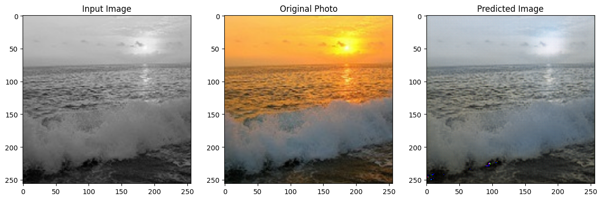
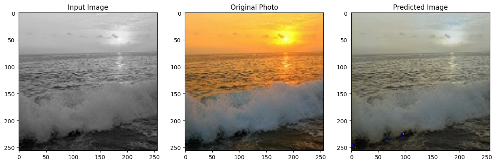
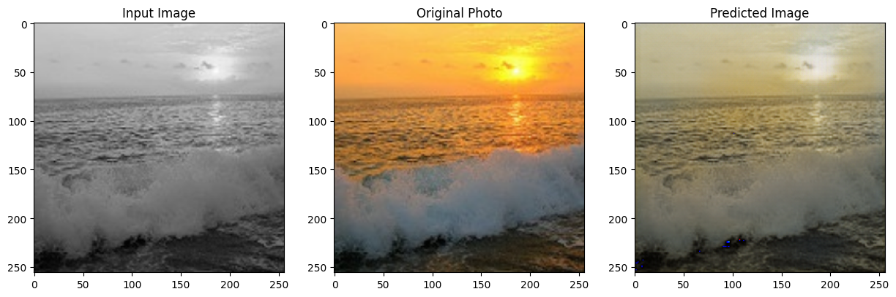

# 🎨 image-colorize
Colorize images with Python deep learning and Convolutional Neural Networks.

## 📓 Notebooks

### 🧪 test_colorize.ipynb
This notebook is used for testing the image colorization process. It contains code to load grayscale images and apply a pre-trained model to colorize them. The results are displayed within the notebook for easy visualization.

#### 💻 Code Explanation
1. **Import Libraries**: The necessary libraries for image processing and model loading are imported.
2. **Load Grayscale Images**: The grayscale images that need to be colorized are loaded into the notebook.
3. **Load Pre-trained Model**: A pre-trained colorization model is loaded. This model has been trained on a large dataset of images to learn how to add color to grayscale images.
4. **Colorize Images**: The pre-trained model is applied to the grayscale images to generate colorized versions.
5. **Display Results**: The original grayscale images and their colorized versions are displayed side by side for comparison.

### 🧠 colorize_with_GAN.ipynb
This notebook demonstrates how to use Generative Adversarial Networks (GANs) for image colorization. It includes code to build and train a GAN model on grayscale images and then use the trained model to generate colorized versions of the images. The notebook provides step-by-step instructions and visual results.

#### 💻 Code Explanation
1. **Import Libraries**: The necessary libraries for deep learning, image processing, and GANs are imported.
2. **Load Dataset**: The dataset of grayscale images is loaded. These images will be used to train the GAN model.
3. **Preprocess Data**: The images are preprocessed, including resizing and normalization, to prepare them for training.
4. **Build GAN Model**: The GAN model is built, consisting of a generator and a discriminator. The generator creates colorized images from grayscale images, while the discriminator evaluates the authenticity of the generated images.
5. **Train GAN Model**: The GAN model is trained on the dataset. During training, the generator and discriminator are updated iteratively to improve the quality of the colorized images.
6. **Generate Colorized Images**: After training, the generator is used to colorize new grayscale images.
7. **Evaluate Results**: The colorized images are evaluated and displayed to visualize the performance of the GAN model.

## 🏗️ GAN Architecture

Our image colorization approach uses a Generative Adversarial Network (GAN) with a U-Net-like generator and a discriminator enhanced with ResNet50 features.

### 🔧 Generator Architecture

The generator follows a U-Net architecture with skip connections, which is particularly effective for image-to-image translation tasks:

1. **Encoder (Downsampling Path)**:
   - Starts with grayscale input images (3-channel input)
   - Contains 8 downsampling blocks that progressively reduce spatial dimensions
   - Each block increases feature depth: 64 → 128 → 256 → 512 → 512 → 512 → 512 → 512
   - Features are extracted at multiple scales and saved for skip connections

2. **Decoder (Upsampling Path)**:
   - Contains 7 upsampling blocks that progressively increase spatial dimensions
   - Each upsampling block is connected to the corresponding encoder block via skip connections
   - Feature depths: 512 → 512 → 512 → 512 → 256 → 128 → 64
   - First 3 upsampling layers use dropout for regularization
   - Final layer outputs a 3-channel colorized image with tanh activation

3. **Skip Connections**:
   - Direct connections between encoder and decoder at same resolution levels
   - Helps preserve detailed spatial information that would otherwise be lost during downsampling
   - Crucial for maintaining structural details in the colorized output

### 🔍 Discriminator Architecture

The discriminator evaluates whether the colorized images are realistic:

1. **Input Processing**:
   - Takes both the input grayscale image and the colorized output (or ground truth)
   - Concatenates them to form a 6-channel input

2. **Feature Extraction**:
   - Uses a series of downsampling convolutional layers
   - Feature depths: 64 → 128 → 256 → 512
   - Reduces the spatial dimensions while increasing feature depth

3. **ResNet50 Integration**:
   - Converts features to 3 channels and processes them through a pre-trained ResNet50
   - Leverages transfer learning from ImageNet weights
   - The ResNet50 part is frozen during training (non-trainable)

4. **Classification Head**:
   - Flattens ResNet50 features and processes through dense layers
   - Final sigmoid activation outputs a single value between 0-1
   - Represents probability that the input is a real (ground truth) pair rather than generated

This GAN architecture strikes a balance between generating detailed colorization and ensuring perceptual quality through the adversarial feedback mechanism.

## 📈 Training Progress Visualization

The following images demonstrate the progressive improvement of our colorization model through increasing training epochs. As you can see, the quality and realism of the colorized images improve significantly as the model undergoes more training iterations.

### ⏱️ Model Evolution Over Training Epochs

| Epoch | Sample Colorized Image |
|-------|------------------------|
| 10 Epochs |  |
| 20 Epochs |  |
| 25 Epochs |  |
| 35 Epochs |  |
| 45 Epochs |  |
| 50 Epochs |  |

This progression clearly shows how the model's ability to produce realistic colorization improves with training. Early epochs (10-20) show basic color recognition but often with less accuracy and vibrancy. By 35-50 epochs, the model achieves much more natural and detailed colorization, with better distinction between different objects and improved color saturation.

The specific code snippet `len(color_img)` is used to get the number of images in the `color_img` list. This list contains the colorized images generated by the GAN model. By checking the length of this list, you can determine how many images have been processed and colorized by the model. This is useful for verifying that the model has processed the expected number of images and for further analysis of the results.